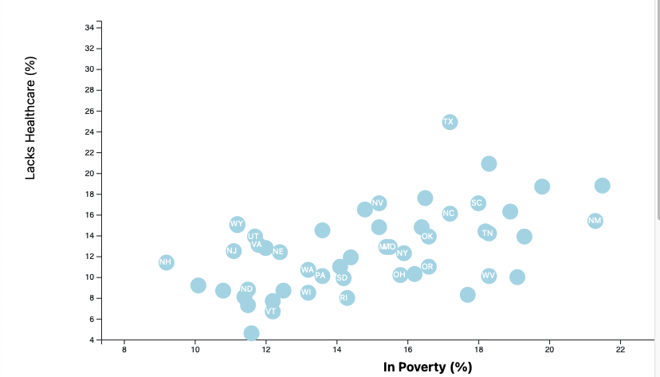

# D3-Challenge

This works is to fulfill requirements towards Data Visualization Bootcamp.

## D3 Dabbler

The core assignment was portion was done.

    1.  State abbreviations in the circles -- The abbreviation were added and they show in the scatter plot, however not all of them are visible. The function is supposed to look for d.abbr but it is still not returning and adding all of the state abbreviations.
    

    2. Labels were created and situated on the bottom and the left of the graph.