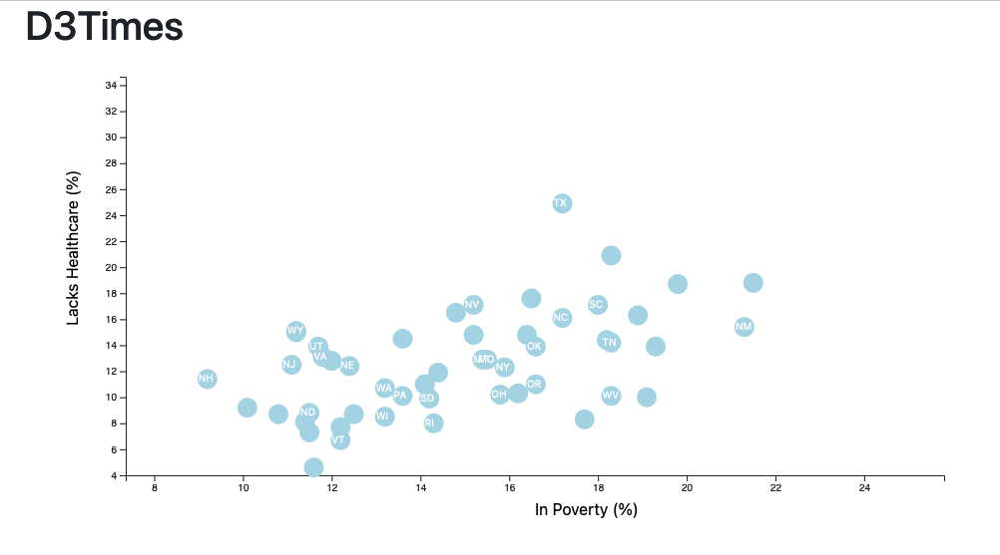

# D3-Challenge

This works is to fulfill requirements towards Data Visualization Bootcamp.

## D3 Dabbler

The core assignment was portion was done (It is all one code although some of the bonus portion was attempted.). Essentially, the code for the hair length vs number of hits used in class was modified to work for this particular assignment.
1.  State abbreviations in the circles -- The abbreviation were added and they show in the scatter plot, however not all of them are visible. The function is supposed to look for d.abbr but it is still not returning and adding all of the state abbreviations.
    

2. Labels were created and situated on the bottom and the left of the graph.
3. Graphs visualized in server -- Using the python -m http.server causes an error due to cross origin requests and access control checks. All the visualizations were done with VS Code extension Live Server instead.

## Bonus

Multiples x axis were created, however the multiple y axis as well as the text showing inside the circles were not obtained. The plot was responsive when clicked in the different x axis.

## Final Thoughts

Additional difficulties:
*   When calling the csv in D3 while the csv file was residing inside the assets/data folder, it would not show any data. It was only when the csv file was moved to the same folder level where the index file was located that it worked. More time would be needed to figure out why the file location could have been making a difference.

Overall assessment:
*   The requirements for this assignments were straightforward and narrowly defined. Even with the challenges encountered, the overall purpose for the assignment was achieved and the concepts behind it were illustrated. With some additional time, practice and familiarity with D3, I would expect to overcome some of the difficulties experienced.
